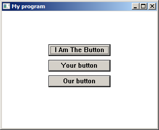

# Declarative GUI library for programming connoisseurs

React is kinda neat... if you ignore for a moment that it is a library for the
abomination that is JavaScript.

That's why we created this library -- for those who want to quickly create GUIs
in a *real* programming language -- so that we can move on to the actually
useful parts of our programms.

## Structure

The library is divided into a C++ frontend (maybe we'll add more languages
later), a C framework library and the backend that converts our widgets into
native widgets, depending on the system.

You just need to define a root function that returns the whole widget tree --
the native widgets will get created, updated and destroyed automatically.

### Frontends

- C++

### Backends

- Win32
- Motif (planned)
- Web (planned)

## Sample

```cpp
#include <perse.h>
#include <hooks.h>

using namespace perse;

Widget Root() {
	SetContext("Root");
	
	auto [text_index, set_text_index] = UseState(0);
	
	auto button_text = [=]() -> std::string {
		switch (text_index % 3) {
			default:
			case 0: return "My Button";
			case 1: return "This Button";
			case 2: return "I Am The Button";
		}
	};

	return Window({
		.width = 320,
		.height = 240,
		.x = -1,
		.y = -1,
		.title = "My program"
	}) << Inside({
		VerticalLayout({}) << Inside({
			AbsoluteLayout({}),
			Button({
				.width = 128,
				.height = 24,
				.text = button_text(),
				.onclick = [=](){
					set_text_index(text_index + 1);
				}
			}),
			AbsoluteLayout({.height=8}),
			Button({
				.width = 128,
				.height = 24,
				.text = "Your button"
			}),
			AbsoluteLayout({.height=8}),
			(text_index % 2 == 1 ? Button({
				.width = 128,
				.height = 24,
				.text = "Our button"
			}) : Null),
			AbsoluteLayout({})
		})
	});
}

int main(int argc, const char** argv) {
	Init();

	SetRoot(Root);

	while (Wait()) {
		
	}
	
	return 0;
}
```




